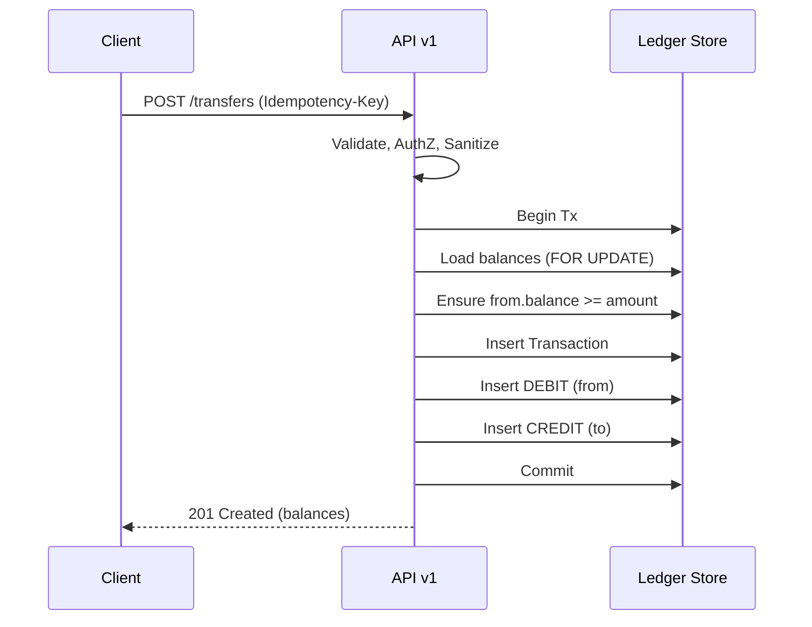

# API 仕様（v1・ミニマム）

- ベース URL: `/api/v1`
- 認証: `Authorization: Bearer <token>`（MVP: バリデーション前提）
- 変更系は `Idempotency-Key` 必須（最大 128 文字の ASCII）。
- `Content-Type: application/json; charset=utf-8`
- 金額は整数（最小単位=円）。

## 共通レスポンス形式（エラー）
```json
{
  "error": {
    "code": "validation_error | not_found | insufficient_funds | conflict | unauthorized | idempotent_replayed",
    "message": "human readable",
    "details": {
      "field": "..."
    }
  }
}
```

---

## 1. 口座作成
- POST `/accounts`

Request
```json
{
  "ownerName": "Taro Yamada"
}
```

Response 201
```json
{
  "id": "a9f1c1a4-...",
  "ownerName": "Taro Yamada",
  "currency": "JPY",
  "status": "ACTIVE",
  "createdAt": "2025-01-01T00:00:00Z"
}
```

---

## 2. 残高照会
- GET `/accounts/{accountId}/balance`

Response 200
```json
{ "accountId": "...", "balance": 150000 }
```

---

## 3. 取引履歴照会
- GET `/accounts/{accountId}/transactions?limit=50&cursor=...&from=...&to=...`

Response 200
```json
{
  "items": [
    {
      "transactionId": "...",
      "type": "DEPOSIT|WITHDRAWAL|TRANSFER",
      "postedAt": "2025-01-01T00:00:00Z",
      "entries": [
        { "direction": "CREDIT", "amount": 10000 },
        { "direction": "DEBIT",  "amount": 10000, "counterpartyAccountId": "..." }
      ]
    }
  ],
  "nextCursor": "..."
}
```

---

## 4. 入金
- POST `/accounts/{accountId}/deposit`
- Headers: `Idempotency-Key: <key>`

Request
```json
{ "amount": 10000, "reason": "cash-in" }
```

Response 201
```json
{
  "transactionId": "...",
  "newBalance": 110000
}
```

---

## 5. 出金
- POST `/accounts/{accountId}/withdraw`
- Headers: `Idempotency-Key: <key>`

Request
```json
{ "amount": 5000, "reason": "cash-out" }
```

Response 201
```json
{
  "transactionId": "...",
  "newBalance": 105000
}
```

エラー例（残高不足） 409
```json
{
  "error": { "code": "insufficient_funds", "message": "balance=3000, amount=5000" }
}
```

---

## 6. 振替
- POST `/transfers`
- Headers: `Idempotency-Key: <key>`

Request
```json
{
  "fromAccountId": "...",
  "toAccountId": "...",
  "amount": 2000,
  "memo": "payment"
}
```

Response 201
```json
{
  "transferId": "...",
  "from": { "accountId": "...", "newBalance": 123000 },
  "to":   { "accountId": "...", "newBalance":  45000 }
}
```

### 振替シーケンス


---

## 冪等性ポリシー
- 変更系（deposit/withdraw/transfer/create-account）は `Idempotency-Key` を必須化。
- 同じキー＋同じリクエストボディは、同じ結果を 200/201 で返す。
- 矛盾するボディで同一キーが再送された場合は 409 `idempotent_replayed`。

## ステータスコード指針
- 200 OK: 取得 API。
- 201 Created: 正常作成（取引/口座）。
- 400 Bad Request: バリデーションエラー。
- 401 Unauthorized: トークン不備/無効。
- 403 Forbidden: 権限不足。
- 404 Not Found: 口座や取引が存在しない。
- 409 Conflict: 残高不足やバージョン競合、冪等キー衝突。
- 422 Unprocessable Entity: 業務条件に違反。
- 500 Internal Server Error: 予期しない障害。

## ページングとソート
- `limit`（1..200）、`cursor`（次ページトークン）でキーセットページング。
- ソートは `postedAt desc` をデフォルト。

## 将来拡張の方向性
- 手数料・利息・拘束（オーソリ）・予約仕訳・逆仕訳。
- マルチ通貨、会計基準準拠の勘定科目・ダブルエントリー厳格化。
- 二重送金防止の強化（送金ロック、分散 ID 発番、SAGA/アウトボックス）。
