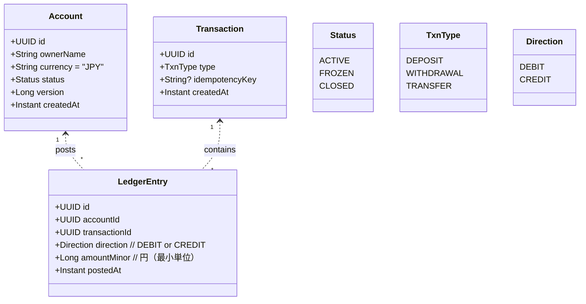
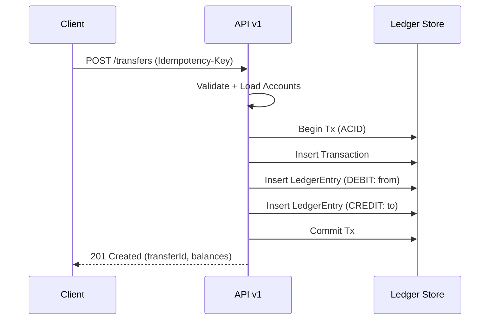

# ドメインモデル

## モデル概要
- 口座（Account）と、追記専用の台帳仕訳（LedgerEntry）で残高を管理。
- 入金/出金/振替は取引（Transaction）として表現し、1..N の仕訳で構成。
- 残高は「仕訳の累計」で導出（計算可能データ）。

- 残高計算: `balance = sum(CREDIT) - sum(DEBIT)`（口座単位）。
- 取引の冪等性: `Transaction.idempotencyKey` をユニーク制約（type+key）で担保。
- 変更履歴: 仕訳は不変。訂正は逆仕訳で取り消す（将来対応）。

## 不変条件（Invariant）
- 仕訳は一度登録したら変更不可（Immutable）。
- 振替は最低 2 行の仕訳（出金=DEBIT、入金=CREDIT）から成り、同一取引に属し原子的に登録。
- 出金/振替において `残高 >= 金額` を満たさない場合は拒否。
- 口座が `FROZEN/CLOSED` の場合、変更系取引は拒否。

## 振替フロー（概念）

