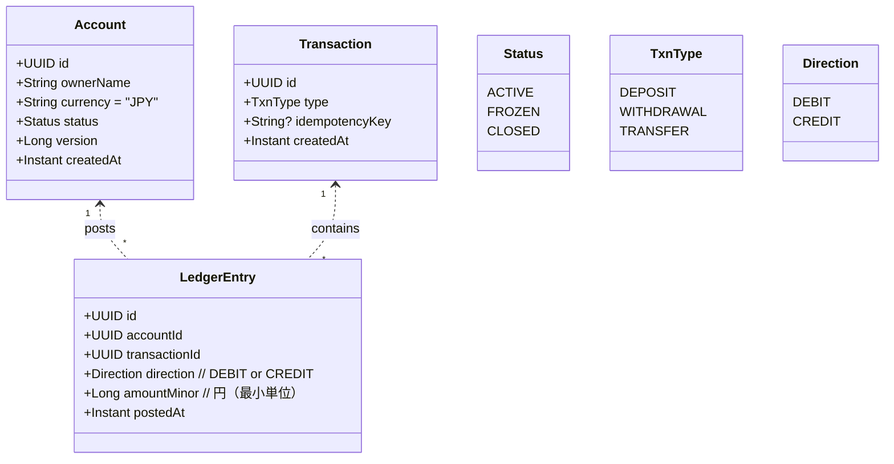
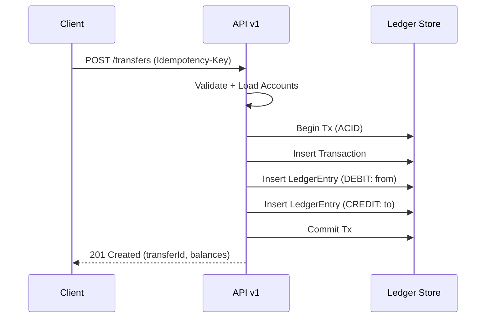

# ドメインモデル

## モデル概要
- 口座（Account）と、追記専用の台帳仕訳（LedgerEntry）で残高を管理。
- 入金/出金/振替は取引（Transaction）として表現し、1..N の仕訳で構成。
- 残高は「仕訳の累計」で導出（計算可能データ）。



- 残高計算: `balance = sum(CREDIT) - sum(DEBIT)`（口座単位）。
- 取引の冪等性: `Transaction.idempotencyKey` をユニーク制約（type+key）で担保。
- 変更履歴: 仕訳は不変。訂正は逆仕訳で取り消す（将来対応）。

## 不変条件（Invariant）
- 仕訳は一度登録したら変更不可（Immutable）。
- 振替は最低 2 行の仕訳（出金=DEBIT、入金=CREDIT）から成り、同一取引に属し原子的に登録。
- 出金/振替において `残高 >= 金額` を満たさない場合は拒否。
- 口座が `FROZEN/CLOSED` の場合、変更系取引は拒否。

## 借方（Debit）/ 貸方（Credit）の扱い
- 本モデルでは「口座残高の変化」に着目して方向を定義。
  - CREDIT: 残高を増加させる仕訳
  - DEBIT : 残高を減少させる仕訳
- 取引タイプとの対応（MVP）
  - 入金（DEPOSIT）: 対象口座に CREDIT を1行計上
  - 出金（WITHDRAWAL）: 対象口座に DEBIT を1行計上
  - 振替（TRANSFER）: 出金元に DEBIT、入金先に CREDIT（同一トランザクションで原子的）
- 金額と符号
  - `amountMinor` は常に正の整数（最小単位=円）。符号は使わない。
  - 取消・訂正は逆方向の新規仕訳を追加して相殺する（将来拡張）。
- 会計用語との注意
  - 一般会計では勘定科目により「借方/貸方が増減どちらか」は異なるが、
    本モデルは API 利用者の直感（残高が増える= CREDIT）を優先して定義している。
  - 会計基準への厳密なマッピングが必要な場合は、勘定科目レイヤや仕訳テンプレートを別途導入する。

例（残高推移）
```
初期残高 0
1) CREDIT +10,000  => 残高 10,000（入金）
2) DEBIT  -3,000   => 残高  7,000（出金）
3) TRANSFER 2,000  => from: DEBIT 2,000（残高 5,000）、to: CREDIT 2,000（相手口座 +2,000）
```

```mermaid
flowchart LR
  subgraph Account A
    A1[CREDIT +10000] --> A2[Balance 10000]
    A2 --> A3[DEBIT -3000]
    A3 --> A4[Balance 7000]
    A4 --> A5[DEBIT -2000 (transfer out)]
    A5 --> A6[Balance 5000]
  end
  subgraph Account B
    B1[CREDIT +2000 (transfer in)] --> B2[Balance +2000]
  end
```

## 振替フロー（概念）

