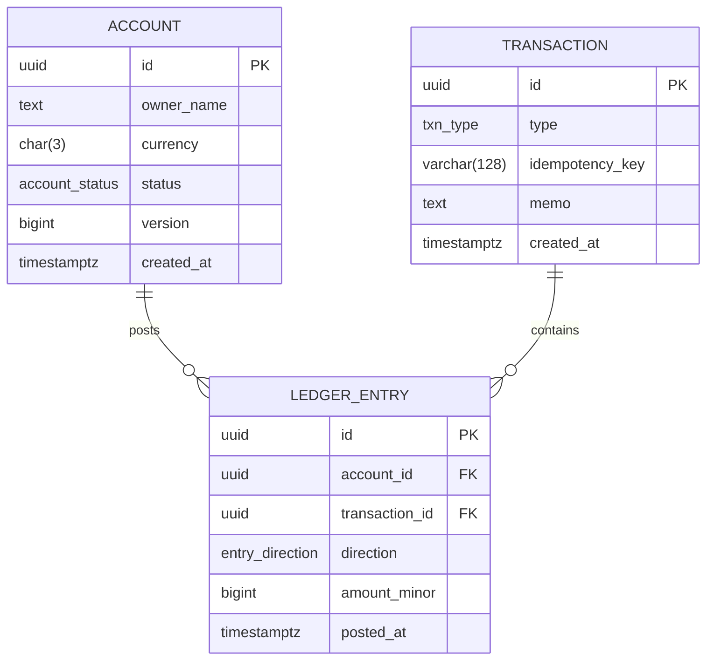

# ER 図（MVP）

```mermaid
erDiagram
  ACCOUNT {
    uuid id PK
    text owner_name
    char(3) currency
    account_status status
    bigint version
    timestamptz created_at
  }

  TRANSACTION {
    uuid id PK
    txn_type type
    varchar(128) idempotency_key
    text memo
    timestamptz created_at
  }

  LEDGER_ENTRY {
    uuid id PK
    uuid account_id FK
    uuid transaction_id FK
    entry_direction direction
    bigint amount_minor
    timestamptz posted_at
  }

  ACCOUNT ||--o{ LEDGER_ENTRY : posts
  TRANSACTION ||--o{ LEDGER_ENTRY : contains
```

補足:

- 残高は `LEDGER_ENTRY` の集計（`CREDIT - DEBIT`）。
- `TRANSACTION (type, idempotency_key)` をユニーク化し、冪等性をDBで担保。
- `LEDGER_ENTRY` はトリガで更新・削除を禁止（追記専用）。
