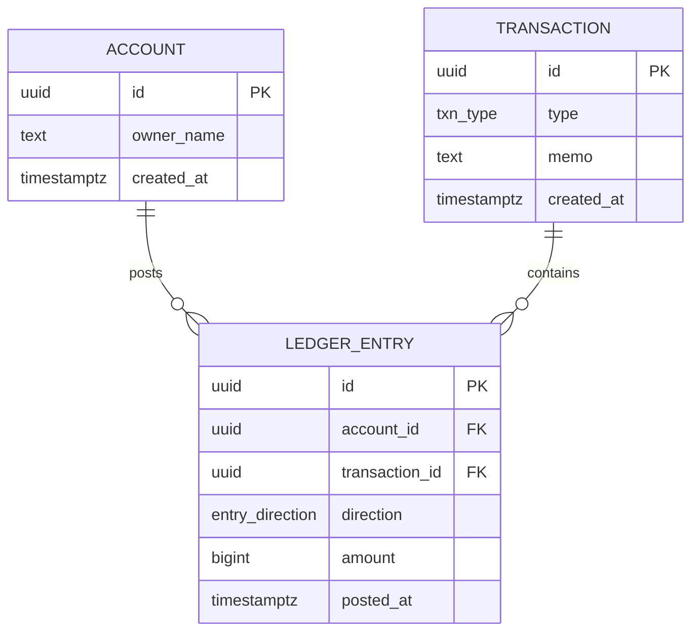

# ER 図

```mermaid
erDiagram
  ACCOUNT {
    uuid id PK
    text owner_name
    timestamptz created_at
  }

  TRANSACTION {
    uuid id PK
    txn_type type
    text memo
    timestamptz created_at
  }

  LEDGER_ENTRY {
    uuid id PK
    uuid account_id FK
    uuid transaction_id FK
    entry_direction direction
    bigint amount
    timestamptz posted_at
  }

  ACCOUNT ||--o{ LEDGER_ENTRY : posts
  TRANSACTION ||--o{ LEDGER_ENTRY : contains
```
