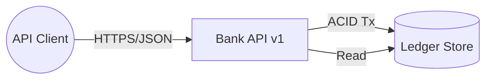

# 要件定義（ミニマム）

## 目的とスコープ

- 個人向けのシンプルな預金口座（JPY 固定）を対象。
- 残高管理、入金、出金、口座間振替、取引履歴照会を API 経由で提供。
- 手数料、利息、為替、複数通貨、勘定科目ツリーなどは本 MVP では対象外（将来拡張）。

## 機能要件

- 口座作成: 新規口座を発行し、初期残高 0 円。
  - in
    - 名義(ただの文字列)
  - out
    - 口座番号
- 残高照会: 現在の口座残高を取得。
  - in
    - 口座番号
  - out
    - 残高(0 以上の整数)
- 入金: 指定金額を口座へ計上（外部起点の入金想定）
  - 物理のお金は考慮しない
  - in
    - 口座番号
    - 金額
  - out
    - 残高
- 出金: 指定金額を口座から計上（残高不足は拒否）
  - in
    - 口座番号
    - 金額
  - out
    - 残高
- 振替: 口座 A から口座 B へ atomic に資金移動（全額成功か全額失敗）
  - 双方の口座にロックをかけて
  - in
    - 口座番号(from)
    - 口座番号(dest)
    - 金額
  - out
    - 口座(from)の残高
  - error
- 取引履歴照会: 期間・ページングで口座の台帳（レジャー）を取得。
  - 期間は絞らず全件返す
  - in
    - 口座番号
  - out
    - リスト
      - 日時(YYYY/MM/DD hh:mm:dd)
      - 操作
      - 振替元口座番号
      - 振替元名義
      - 金額、残高
- 画面(後付け)
  - 上記の機能をブラウザ上で使える UI

### 作らないもの(TBD)

- 詳細な名義(ユーザー)
- ログイン、認証機能
- 支店マスタ

## 非機能要件（MVP 基準）

- 整合性: 強整合（単一データストアの ACID トランザクション）
- 金額表現: 通貨は JPY 固定。整数の最小単位（円）で扱う（BigDecimal）
- タイムゾーン: API は ISO-8601（`YYYY-MM-DDTHH:mm:ss`）。

## ドメイン定義（抜粋）

- 口座（Account）: 残高を持つ主体。状態は `ACTIVE`/`FROZEN`/`CLOSED`（MVP: ACTIVE のみ）。
- 取引（Transaction）: 入金/出金/振替の論理単位。複数の仕訳（LedgerEntry）からなる。
- 仕訳（LedgerEntry）: 勘定記録の最小単位。`DEBIT`/`CREDIT` と金額、対象口座を持つ（不変・追記型）。
- 残高（Balance）: 仕訳の集計で導出。`CREDIT - DEBIT` の累計（JPY）。

## 不変条件

- 台帳は追記型で、登録済み仕訳は変更不可。
- 振替は原子的に両側（出金・入金）を計上し、一方のみの反映は不可。
- 残高不足の場合は出金・振替を拒否（デフォルト: オーバードラフト無し）。

## API 概要

- プロトコル: REST over HTTPS、JSON（UTF-8）。
- エラー: 構造 `{ error: { code, message, details? } }` を返す。HTTP とアプリコードを併用。

